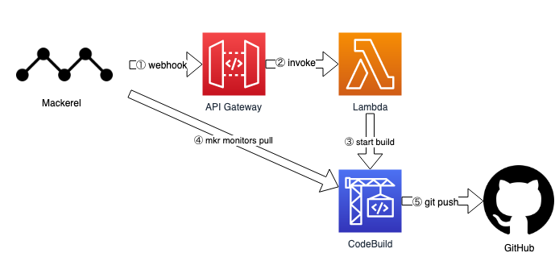

# serverless-mkr-monitors
serverless-mkr-monitors is a serverless application for version control of monitoring settings in Mackerel to the GitHub repository.

## Usage
Available on the [AWS Serverless Application Repository](https://console.aws.amazon.com/lambda/home#/create/app?applicationId=arn:aws:serverlessrepo:us-east-1:678291135883:applications/serverless-mkr-monitors)

After deployment, input the ApiEndpoint URL from CloudFormation outputs to the Mackerel webhook.

## Presentations (Japanese)

- [自動でMackerelの監視設定をGitHub上に管理する](https://developer.hatenastaff.com/entry/2019/04/16/130000)

## Licence
Apache License 2.0 (Apache-2.0)

## Author

[cohalz](https://github.com/cohalz)
